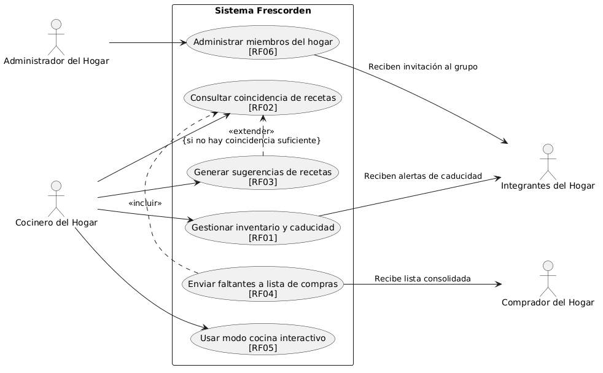
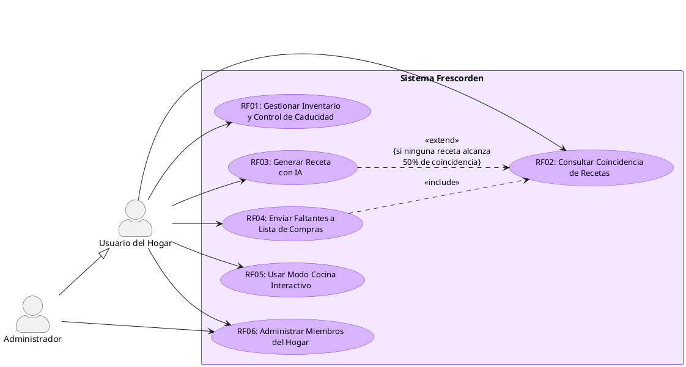
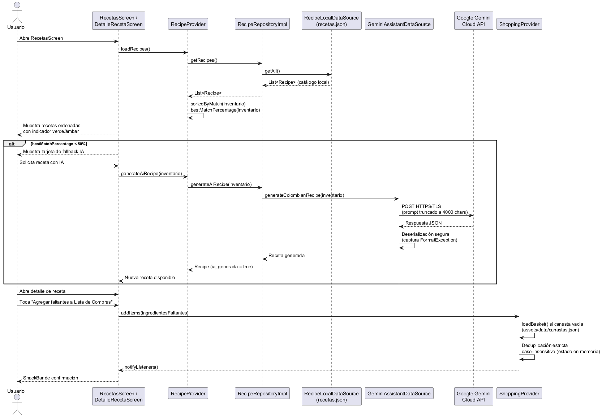
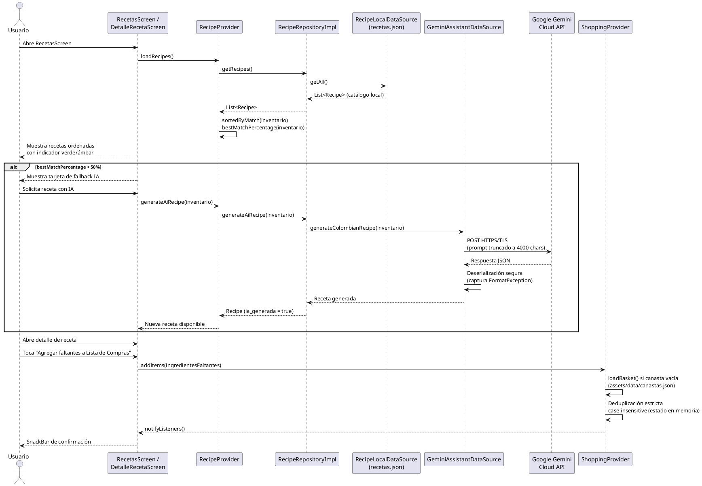
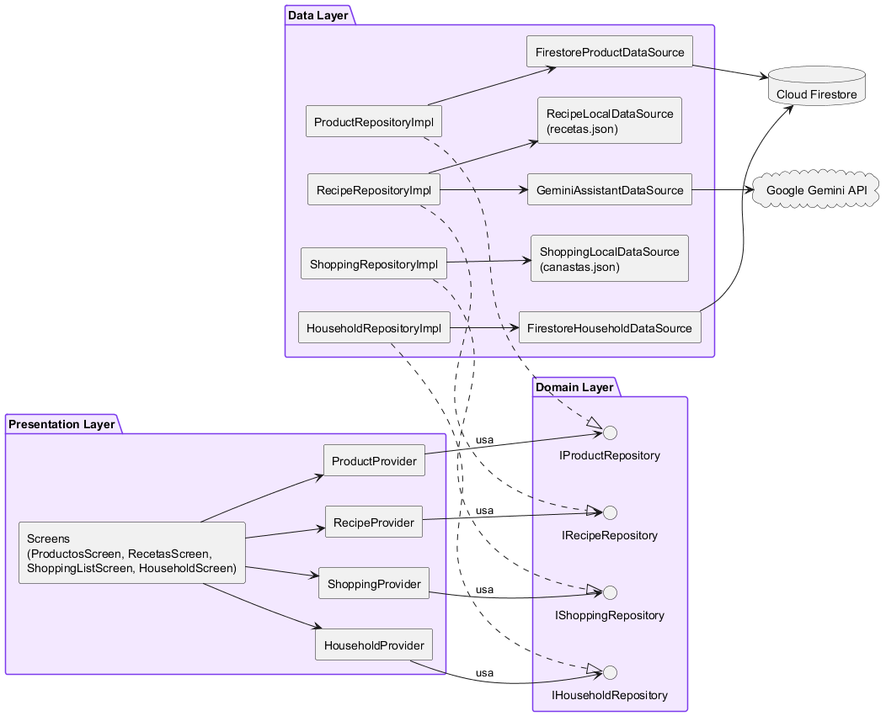
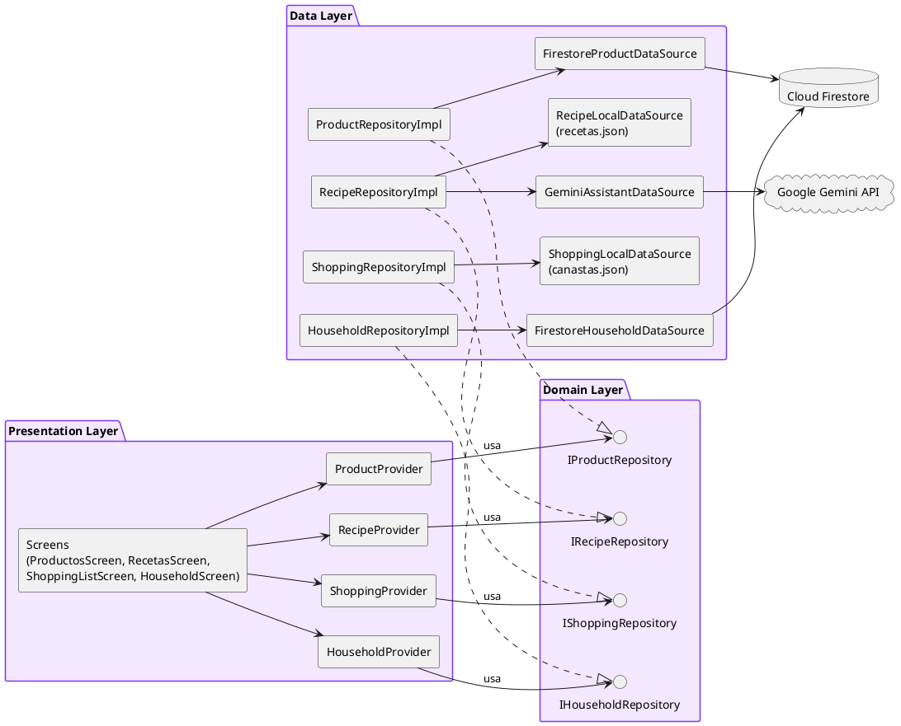
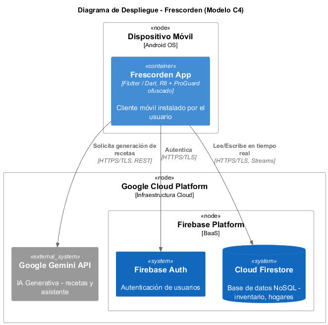
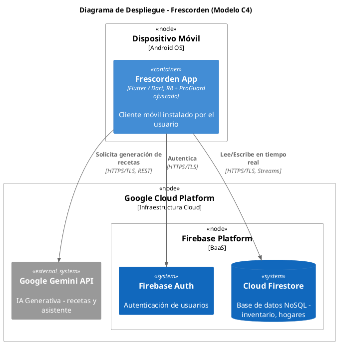
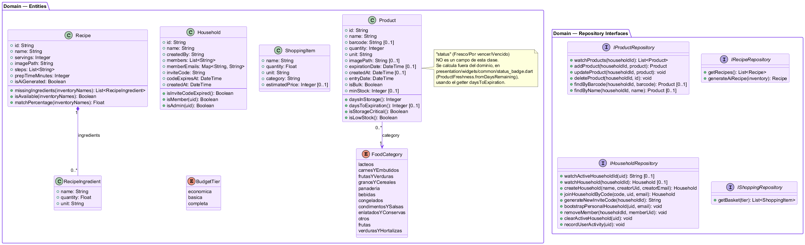

# Fase 3 — Arquitectura y Diagramación UML/C4

**Proyecto:** Frescorden — Gestión integral de alimentos en el hogar
**Universidad:** Universidad de Cundinamarca (UDEC)
**Rol de elaboración:** Arquitecto de Software & Diseñador UML/C4
**Consistencia terminológica:** todos los diagramas reutilizan literalmente los nombres de `FASE1_REQUERIMIENTOS.md` (RF01-RF06, RNF01-RNF04) y `FASE2_HISTORIAS_USUARIO.md` (HU01-HU06).

> **Nota metodológica de esta fase:** los 4 diagramas de este documento se generaron y se estandarizaron en **PlantUML** (se migró desde Mermaid.js, usado en versiones anteriores), para obtener notación UML real en todos los casos — actores con silueta humana, generalización con triángulo hueco, realización de interfaces con flecha punteada + triángulo hueco, y la sintaxis C4 real de despliegue mediante la librería estándar `C4-PlantUML` incluida en el `.jar`. Todos se **validaron renderizándolos** con `java -jar plantuml.jar -charset UTF-8` antes de entregarse — no son sintaxis escrita a mano sin comprobar, y se re-validaron tras cada corrección (incluida la corrección de un bug real de codificación de caracteres: sin el flag `-charset UTF-8`, los acentos se corrompían, ej. "Móvil" → "Móvil"). Además, durante la verificación contra el código real se corrigieron varias afirmaciones incorrectas o técnicamente cuestionables heredadas de fases anteriores (ver sección "Correcciones de Arquitectura" al final): la canasta de compras y el catálogo de recetas **no** viven en Firestore, los ítems agregados a la lista de compras **no se persisten en ningún lugar**, el diagrama de casos de uso modelaba al propio sistema como su actor, y el diagrama de secuencia disimulaba una llamada de red real como un mensaje interno.

---

## 1. Introducción a la Arquitectura

Frescorden se construye sobre dos decisiones arquitectónicas centrales:

1. **Clean Architecture** en el cliente Flutter, con tres capas de dependencia estrictamente unidireccional: `Presentation → Domain ← Data`. El dominio (`lib/domain/`) no conoce Firebase, Gemini ni Flutter UI — solo define entidades e interfaces de repositorio (`I*Repository`). Esto es lo que permitió, en la Fase 6 del desarrollo, sustituir cada repositorio real por un *fake* en memoria para las pruebas automatizadas sin tocar ninguna pantalla.
2. **Backend serverless (Cloud Serverless)**: no existe un servidor propio. Firebase actúa como *Backend as a Service* (Auth, Firestore, reglas de seguridad declarativas en `firestore.rules`), y Google Gemini API se consume directamente desde el cliente vía el SDK `firebase_ai`. La única lógica de servidor real que posee el proyecto son las reglas de Firestore.

Una particularidad importante, confirmada en el código y no evidente en las Fases 1-2: **no todos los datos usan Firestore**. El catálogo de recetas (`assets/data/recetas.json`) y el catálogo de canastas por presupuesto (`assets/data/canastas.json`) son *assets* estáticos empaquetados con la app — contenido curado, no datos de usuario, por lo que no se justificó una colección en la nube. Firestore se reserva para lo que sí es dato de usuario y debe sincronizarse entre dispositivos: inventario (`Product`), hogares (`Household`) y su actividad.

**Estado de la capa de Presentación:** hasta una auditoría posterior a este documento, la mayoría de las pantallas reales de la app vivían en `lib/screens/` y `lib/Widgets/` — dos carpetas de nivel raíz fuera de `lib/presentation/`, residuo de una migración a Clean Architecture que nunca se completó del todo. Se corrigió con un refactor real de código (no solo documentación): las 16 pantallas y el widget legacy se movieron a `lib/presentation/screens/` y `lib/presentation/widgets/`, se corrigieron todos los imports afectados, y `flutter analyze`/`flutter test` confirman 0 incidencias y 29/29 pruebas pasando tras el cambio. Detalle completo en la sección 9.

---

## 2. Diagrama de Casos de Uso (UML)

**Cambio de herramienta:** este diagrama se generó con **PlantUML** (no Mermaid), para poder usar notación UML real de casos de uso — actores con silueta humana, óvalos y la flecha de triángulo hueco de generalización — en vez de la aproximación con `flowchart` usada en versiones anteriores de este documento. Se validó renderizándolo con `java -jar plantuml.jar` antes de entregarlo (el paquete `node-plantuml`/`npx` trae internamente una versión de PlantUML de 2019 con un bug conocido para diagramas de casos de uso; se usó en su lugar el `.jar` oficial actualizado, descargado de Maven Central).

**Alcance de actores:** por instrucción explícita, este diagrama muestra **solo actores humanos** — Google Gemini API y Cloud Firestore (presentes en versiones anteriores) se retiraron. Su interacción con el sistema ya queda representada en el Diagrama de Secuencia (sección 3) y el Diagrama de Despliegue (sección 5); no es información que se pierda, solo que no se repite aquí.

**Actores:**
- **Usuario del Hogar**: actor principal, humano.
- **Administrador**: actor especializado — relación de **generalización UML** (`Admin --|> Usuario`, triángulo hueco) hacia Usuario del Hogar. Todo administrador es también un usuario del hogar, con la capacidad adicional de administrar membresía (RF06).

Fuente PlantUML (<code>docs/casos_de_uso_frescorden.puml</code>)

**Verificación de las relaciones `<<extend>>`/`<<include>>`** (dirección UML: la flecha va del caso secundario/base hacia el caso base/incluido):
- **RF03 `<<extend>>` RF02**: RF03 es comportamiento *opcional* que solo se activa cuando el mejor porcentaje de coincidencia de RF02 cae bajo el 50% — la condición de guarda `{si ninguna receta alcanza 50% de coincidencia}` queda explícita en el propio diagrama, en vez de asumirse implícita. Se usó esta condición verificada en el código (`bestMatchPercentage < 0.5`), no la fórmula genérica de ejemplo ("si no hay coincidencias directas"), que describía un umbral distinto (cero coincidencias) al que realmente implementa el sistema.
- **RF04 `<<include>>` RF02**: RF04 siempre requiere el cálculo de ingredientes faltantes que produce RF02 — es una sub-conducta obligatoria, no opcional, uso correcto de `include`.

---

## 3. Diagrama de Secuencia — Flujo Crítico

Flujo completo solicitado: **Consulta de Recetas → Cálculo de Match → Fallback de IA con Gemini API → Deduplicación y Transferencia a Lista de Compras**, con los nombres reales de clases del código (`RecipeProvider`, `RecipeRepositoryImpl`, `RecipeLocalDataSource`, `GeminiAssistantDataSource`, `ShoppingProvider`).

`GeminiAssistantDataSource` (clase local) y `Google Gemini Cloud API` (servicio externo) se representan como dos participantes separados con un salto de red real (`POST HTTPS/TLS`) entre ellos — no como un mensaje del mismo participante hacia sí mismo, para que la frontera de confianza de red quede explícita.

Fuente PlantUML (<code>docs/secuencia_frescorden.puml</code>)

---

## 4. Diagrama de Componentes (Clean Architecture)

Mapeo 1:1 con las clases reales del repositorio — no son nombres genéricos de ejemplo. Ahora usa notación UML de Componentes real: `interface` con círculo ("lollipop") para cada contrato de repositorio, y flecha punteada + triángulo hueco (`..|>`) para la relación de **realización** (Impl implementa la interfaz) — la limitación que Mermaid tenía para esto ya no aplica. **Aclaración de alcance:** el dominio real tiene 11 interfaces de repositorio (`IAuthRepository`, `IAdminRepository`, `IAnalyticsRepository`, etc.); este diagrama solo muestra las 4 directamente relacionadas con RF01-RF06, para no diluir el diagrama con módulos fuera del alcance de esta especificación.

Fuente PlantUML (<code>docs/componentes_frescorden.puml</code>)

**Nota:** `RecipeRepositoryImpl` depende de **dos** datasources simultáneamente (`RecipeLocalDataSource` para el catálogo curado y `GeminiAssistantDataSource` para el fallback de IA) — es la única implementación de repositorio con esta doble dependencia, reflejo directo de RF02+RF03 conviviendo en la misma historia de negocio.

---

## 5. Diagrama de Despliegue (Modelo C4 — Nivel de Despliegue)

Usa la librería estándar **C4-PlantUML** (`!include <C4/C4_Deployment>`, incluida en el `.jar` oficial de PlantUML, sin dependencia de red) — es la notación C4 real, no una aproximación genérica de despliegue UML. Antes se generaba con el soporte nativo `C4Deployment` de Mermaid; se migró aquí por consistencia con el resto del documento, sin perder rigor: ambas son sintaxis C4 auténtica, solo cambia la herramienta.

Fuente PlantUML (<code>docs/despliegue_frescorden.puml</code>)

**Relación con RNF02** (Eficiencia de Recursos y Protección del Binario de Distribución): el nodo `app` incluye explícitamente R8/ProGuard porque es el único componente que corre en un entorno no controlado por el equipo (el dispositivo del usuario), y es donde aplica la ofuscación auditada en la Fase 1.

**Nota de alcance:** `firebase_storage` está declarado en `pubspec.yaml` pero no se usa en ningún archivo de `lib/` — se verificó explícitamente antes de dibujar este diagrama y se excluyó a propósito, ya que documentarlo habría sido describir infraestructura que no corre en producción. Se recomienda evaluar si esa dependencia debe eliminarse del proyecto (fuera del alcance de esta fase de documentación).

---

## 6. Diagrama de Clases del Dominio

Modela únicamente `lib/domain/` — entidades, value objects, el único enum real de dominio (`FoodCategory`) y las interfaces de repositorio, con atributos y firmas de método copiados 1:1 del código, no simplificados ni idealizados.

```plantuml
@startuml
skinparam backgroundColor white
skinparam class {
  BackgroundColor #F3E8FF
  BorderColor #7C3AED
  ArrowColor #7C3AED
}
skinparam package {
  BackgroundColor white
  BorderColor #7C3AED
}

package "Domain — Entities" {
  class Product {
    +id: String
    +name: String
    +barcode: String [0..1]
    +quantity: Integer
    +unit: String
    +imagePath: String [0..1]
    +expirationDate: DateTime [0..1]
    +createdAt: DateTime [0..1]
    +entryDate: DateTime
    +isBulk: Boolean
    +minStock: Integer [0..1]
    --
    +daysInStorage(): Integer
    +daysToExpiration(): Integer [0..1]
    +isStorageCritical(): Boolean
    +isLowStock(): Boolean
  }

  note right of Product
    "status" (Fresco/Por vencer/Vencido)
    NO es un campo de esta clase.
    Se calcula fuera del dominio, en
    presentation/widgets/common/status_badge.dart
    (ProductFreshness.fromDaysRemaining),
    usando el getter daysToExpiration.
  end note

  enum FoodCategory {
    lacteos
    carnesYEmbutidos
    frutasYVerduras
    granosYCereales
    panaderia
    bebidas
    congelados
    condimentosYSalsas
    enlatadosYConservas
    otros
    frutas
    verdurasYHortalizas
  }

  class Recipe {
    +id: String
    +name: String
    +servings: Integer
    +imagePath: String
    +steps: List<String>
    +prepTimeMinutes: Integer
    +isAiGenerated: Boolean
    --
    +missingIngredients(inventoryNames): List<RecipeIngredient>
    +isAvailable(inventoryNames): Boolean
    +matchPercentage(inventoryNames): Float
  }

  class RecipeIngredient {
    +name: String
    +quantity: Float
    +unit: String
  }

  class Household {
    +id: String
    +name: String
    +createdBy: String
    +members: List<String>
    +memberEmails: Map<String, String>
    +inviteCode: String
    +codeExpiresAt: DateTime
    +createdAt: DateTime
    --
    +isInviteCodeExpired(): Boolean
    +isMember(uid): Boolean
    +isAdmin(uid): Boolean
  }

  class ShoppingItem {
    +name: String
    +quantity: Float
    +unit: String
    +category: String
    +estimatedPrice: Integer [0..1]
  }

  enum BudgetTier {
    economica
    basica
    completa
  }
}

package "Domain — Repository Interfaces" {
  interface IProductRepository {
    +watchProducts(householdId): List<Product>
    +addProduct(householdId, product): Product
    +updateProduct(householdId, product): void
    +deleteProduct(householdId, id): void
    +findByBarcode(householdId, barcode): Product [0..1]
    +findByName(householdId, name): Product [0..1]
  }

  interface IRecipeRepository {
    +getRecipes(): List<Recipe>
    +generateAiRecipe(inventory): Recipe
  }

  interface IHouseholdRepository {
    +watchActiveHouseholdId(uid): String [0..1]
    +watchHousehold(householdId): Household [0..1]
    +createHousehold(name, creatorUid, creatorEmail): Household
    +joinHouseholdByCode(code, uid, email): Household
    +generateNewInviteCode(householdId): String
    +bootstrapPersonalHousehold(uid, email): void
    +removeMember(householdId, memberUid): void
    +clearActiveHousehold(uid): void
    +recordUserActivity(uid): void
  }

  interface IShoppingRepository {
    +getBasket(tier): List<ShoppingItem>
  }
}

Product "0..*" --> "1" FoodCategory : category
Recipe "1" *-- "0..*" RecipeIngredient : ingredients
@enduml
```

Fuente PlantUML (<code>docs/diagrama_clases_dominio.puml</code>)

**Notas de verificación:**
- La cardinalidad `Recipe "1" *-- "0..*" RecipeIngredient` usa `0..*` (no `1..*`) porque `Recipe.matchPercentage()` maneja explícitamente el caso de una lista de ingredientes vacía (`if (ingredients.isEmpty) return 1;`) — el propio código contempla ese caso límite, así que el diagrama lo refleja. Es composición real (`*--`, diamante relleno del lado de `Recipe`), no una asociación simple.
- `IShoppingRepository` tiene un único método (`getBasket`) — no existe ningún método de escritura/persistencia en su contrato. Esto es evidencia adicional, a nivel de interfaz de dominio, de que la lista de compras nunca estuvo diseñada para persistirse (ver sección 7).
- Los 3 enums pedidos originalmente en el brief inicial de esta tarea (`StorageLocation`, `UnitType`, `MatchLevel`) no aparecen porque no existen en el código — se verificó `product.dart`, `shopping_item.dart` y `recipe.dart` línea por línea antes de descartarlos.

**Ajuste de notación UML (revisión posterior):** la primera versión de este diagrama tipaba atributos y métodos con sintaxis de Dart (`Future<T>`, `Stream<T>`, `T?`, `num`, `int`, `bool`) en vez de tipos estándar de análisis UML. Se corrigió en dos rondas: `Future<T>`/`Stream<T>` se retiran de las firmas de método (son detalles de modelo de ejecución/concurrencia, no conceptos de dominio), `T?` se reemplaza por multiplicidad `[0..1]`, `num`/`int` por `Float`/`Integer`, y `bool` por `Boolean`. También se eliminó el atributo `category: FoodCategory` duplicado dentro de `Product` (ya estaba representado como línea de asociación hacia el enum) y las flechas de dependencia `..>` entre las interfaces y las entidades, redundantes con los tipos ya visibles en cada firma de método. `void` se dejó en su forma actual — es el único identificador que no tiene un equivalente de tipo UML (no es un tipo, es la ausencia de uno), así que no aplica la misma sustitución.

---

## 7. Especificación del Esquema NoSQL en Cloud Firestore (Realidad Auditada)

Cada tabla siguiente corresponde a una colección o subcolección que **realmente existe** en el código (`lib/data/datasources/firestore_*.dart`, `lib/data/models/*_model.dart`), con los tipos tal como se serializan de verdad — incluyendo la deuda técnica encontrada, no una versión idealizada.

### `households/{householdId}/productos` (subcolección)

| Campo | Tipo Firestore | Notas |
|---|---|---|
| *(id del documento)* | — | No es un campo; es el ID del documento |
| `name` | String | |
| `barcode` | String (opcional) | |
| `quantity` | **String** | ⚠️ Deuda técnica: el dominio lo tipa `int`, pero se serializa con `quantity.toString()` |
| `unit` | String | |
| `imagePath` | String (opcional) | Alias legacy `image` también aceptado en lectura (compatibilidad retroactiva) |
| `expirationDate` | **String (ISO8601)**, opcional | ⚠️ No es `Timestamp` nativo de Firestore |
| `entryDate` | **String (ISO8601)** | ⚠️ No es `Timestamp` nativo de Firestore |
| `createdAt` | String (ISO8601), opcional | ⚠️ No es `Timestamp` nativo de Firestore |
| `isBulk` | bool | |
| `category` | String | Nombre del enum `FoodCategory` (`FoodCategory.name`) |
| `minStock` | int (opcional) | |

`householdId` **no es un campo del documento** — está implícito en la ruta de la subcolección (`households/{householdId}/productos/{id}`), no se duplica como dato.

**Índice compuesto recomendado:** `category + expirationDate` (ascendente) — necesario si se quiere ordenar por vencimiento dentro de una categoría específica; no se necesita índice sobre `householdId` porque el filtro por hogar es estructural (la ruta de la subcolección), no una cláusula `where()`.

### `households` (colección raíz)

| Campo | Tipo Firestore | Notas |
|---|---|---|
| *(id del documento)* | — | |
| `name` | String | |
| `createdBy` | String | uid del administrador |
| `members` | Array\<String\> | uids de todos los miembros, incluido el creador |
| `memberEmails` | Map\<String, String\> | uid → email, denormalizado a propósito |
| `inviteCode` | String | |
| `codeExpiresAt` | **Timestamp** | ✅ Sí usa `Timestamp` nativo (contraste directo con `productos`) |
| `createdAt` | **Timestamp** | ✅ Sí usa `Timestamp` nativo |

### `inviteCodes` (colección auxiliar de lookup)

| Campo | Tipo Firestore | Notas |
|---|---|---|
| *(id del documento = el propio código de invitación)* | — | |
| `householdId` | String | único campo del documento |

Existe porque las reglas de seguridad de Firestore no permiten una consulta (`where`) sobre `households` para alguien que todavía no es miembro — un `get` puntual por ID de documento sí puede evaluarse individualmente. Es un patrón de diseño deliberado documentado en el propio código (`firestore_household_datasource.dart`), no una colección redundante.

### `usuarios/{uid}` (perfil de usuario)

| Campo | Tipo Firestore | Notas |
|---|---|---|
| `activeHouseholdId` | String (opcional) | hogar activo actual; se borra con `FieldValue.delete()` al salir de un hogar |
| `lastActiveAt` | Timestamp (`serverTimestamp()`) | actividad reciente, alimenta el Panel Administrativo |
| `createdAt` | Timestamp (`serverTimestamp()`) | se fija una sola vez, con transacción para no pisarlo |

### Fuentes explícitamente NO persistidas en Firestore

| Dato | Origen real | Por qué no está en Firestore |
|---|---|---|
| Catálogo de recetas | `assets/data/recetas.json` (asset local) | Contenido curado y estático, no dato de usuario |
| Canasta base por presupuesto | `assets/data/canastas.json` (asset local) | Igual criterio: contenido curado, no dato de usuario |
| Ítems agregados a la lista de compras | `ShoppingProvider._extraItems` (memoria volátil) | Nunca se diseñó como dato persistente — `IShoppingRepository` ni siquiera tiene un método de escritura (ver sección 6) |

### Hallazgos técnicos documentados

1. **Asimetría de fechas:** `productos` serializa sus fechas como `String` ISO8601, mientras que `households` sí usa `Timestamp` nativo de Firestore para las suyas. Es una inconsistencia real del código (verificada en `product_model.dart` vs. `household_model.dart`), no un error de esta documentación — se deja registrada como hallazgo, sin corregirla, porque corregir código está fuera del alcance de esta fase.
2. **`quantity` como String:** el dominio (`Product.quantity`) lo tipa `int`, pero `ProductModel.toFirestore()` lo serializa como `quantity.toString()` — deuda técnica explícita, con comentario propio en el código ("legacy: guardado como String").

---

## 8. Propuesta de Arquitectura Futura (Trabajo Futuro — no implementado)

Todo lo que sigue es una **propuesta de diseño**, no una descripción de lo que existe hoy. Se incluye porque el propio código ya lo anticipa: el comentario de `i_recipe_repository.dart` dice textualmente *"la implementación real (assets locales, **Firestore en el futuro**, etc.) vive en `lib/data/`"* — es decir, migrar recetas a Firestore ya estaba contemplado por quienes escribieron la interfaz, esta sección solo formaliza esa intención.

**Motivación:** las dos limitaciones reales documentadas en la sección 7 (recetas no editables por el usuario, lista de compras que no sobrevive el cierre de la app ni se comparte entre miembros del hogar) son aceptables para una versión de un solo dispositivo, pero bloquean un caso de uso multiusuario real: dos miembros del mismo hogar viendo la misma lista de compras actualizarse en tiempo real, igual que ya ocurre con el inventario (RF01) hoy.

### `recipes` (colección raíz propuesta)

| Campo | Tipo Firestore propuesto | Notas |
|---|---|---|
| *(id del documento)* | — | |
| `title` | String | |
| `ingredients` | Array\<Map\> | cada elemento: `{name, quantity, unit}` |
| `instructions` | Array\<String\> | pasos, en orden |
| `imagePath` | String | |
| `prepTimeMinutes` | int | |
| `isAiGenerated` | bool | |
| `createdBy` | String (opcional) | uid, si se habilita que usuarios contribuyan recetas propias |
| `createdAt` | **Timestamp** | nativo desde el diseño — no repetir la inconsistencia de `productos` |

### `households/{householdId}/shopping_list` (subcolección propuesta, análoga a `productos`)

| Campo | Tipo Firestore propuesto | Notas |
|---|---|---|
| *(id del documento)* | — | |
| `name` | String | |
| `quantity` | **number** (no String) | corrige la deuda técnica ya encontrada en `productos.quantity` |
| `unit` | String | |
| `category` | String | |
| `estimatedPrice` | int (opcional) | |
| `isPurchased` | bool | marca si ya se compró |
| `autoAdded` | bool | `true` si vino de "faltantes de receta" o "Plato Equilibrado"; `false` si el usuario lo agregó manualmente |
| `addedBy` | String (opcional) | uid — necesario para trazabilidad en un hogar con varios miembros agregando ítems |
| `addedAt` | **Timestamp** | nativo desde el diseño |

**Índice compuesto sugerido:** `isPurchased + addedAt` — para poder listar eficientemente "pendientes por comprar, más recientes primero" sin traer todo el documento y filtrar en el cliente.

**Consideraciones de migración (no triviales):**
- La deduplicación que hoy vive en `ShoppingProvider` (en memoria, single-device) tendría que moverse a una transacción de Firestore o una Cloud Function al escribir, para mantener el mismo comportamiento bajo escritura concurrente de varios miembros del hogar a la vez.
- `IShoppingRepository` tendría que ganar métodos de escritura (`addItem`, `markPurchased`, `removeItem`) que hoy no existen — es un cambio de contrato de dominio, no solo de la capa de datos.
- Se recomienda `Timestamp` nativo y `quantity` como `number` desde el primer commit de esta migración, en vez de repetir las inconsistencias ya encontradas en `productos`.

---

## 9. Correcciones de Arquitectura (auditoría contra el código real)

Durante la elaboración de esta fase se verificaron los diagramas contra el código fuente (`lib/data/repositories/`, `lib/data/datasources/`) y se encontraron dos afirmaciones incorrectas en `FASE1_REQUERIMIENTOS.md` y `FASE2_HISTORIAS_USUARIO.md`, ya corregidas en ambos documentos:

| Afirmación u decisión original (revisada) | Realidad verificada / corrección aplicada | Impacto |
|---|---|---|
| La canasta de compras se carga "desde Firestore" (RF04, HU04) | Se carga desde `assets/data/canastas.json`, un asset local estático (`ShoppingLocalDataSource`) | Bajo — solo terminología, no afecta la lógica de negocio documentada |
| El inventario, la lista de compras y la actividad del hogar se sincronizan en tiempo real vía Firestore (RF06) | Solo el inventario y la actividad del hogar sincronizan por Firestore. La lista de compras es **estado en memoria, sin persistencia**, no se comparte entre miembros del hogar ni sobrevive el cierre de la app | **Medio** — es una limitación de confiabilidad real del sistema, no solo un error de redacción |
| Las descripciones de RF01-RF06 citaban clases y métodos del código (`ShoppingProvider.addItems`, `IProductRepository`, etc.) | Reescritas en lenguaje de negocio puro, sin identificadores de código — la trazabilidad técnica queda solo en los diagramas de esta Fase 3 | **Medio** — mezclar requisito con diseño es un error metodológico de separación de fases, no solo de estilo |
| RNF02 y RNF04 nombraban un mecanismo (`R8/ProGuard`) o una métrica puntual (`29/29 Pruebas Pasadas`) directamente en el nombre del requerimiento | Renombrados a su atributo de calidad puro (Eficiencia de Recursos y Protección del Binario / Confiabilidad y Calidad de Código); el mecanismo y la cifra quedan como evidencia de cumplimiento, no como parte de la identidad del requerimiento | Bajo-Medio — una métrica fija en el nombre caduca en cuanto el proyecto crece |
| El Diagrama de Casos de Uso modelaba "Sistema Frescorden" como actor de sí mismo | Reemplazado por **Cloud Firestore** como actor externo real, que cumple la misma función narrativa (disparador automático) sin violar la notación UML | Medio — un actor que es el propio sistema es un error de notación detectable por cualquier evaluador con formación UML |
| El Diagrama de Secuencia representaba la llamada a Gemini como un mensaje del participante hacia sí mismo | Separado en `GeminiAssistantDataSource` (clase local) y `Google Gemini Cloud API` (servicio externo), exponiendo el salto de red real | Bajo-Medio — ocultaba la frontera de confianza de red, relevante para el análisis de seguridad (RNF01) |
| Las relaciones `<<extend>>`/`<<include>>` no tenían condición de guarda explícita | Se agregó la condición real verificada en código al `<<extend>>` (`bestMatchPercentage < 50%`), reemplazando la fórmula de ejemplo original ("si no hay coincidencias directas", que describía un umbral distinto) | Bajo — precisión de la condición, no cambia la relación en sí |
| El Diagrama de Casos de Uso pasó por varias versiones del actor Administrador (agregado con flecha punteada de Mermaid, luego retirado) | Versión final: se migró todo el diagrama a **PlantUML** (notación UML real) y se reincorporó **Administrador** con una relación de **generalización** propiamente dicha (triángulo hueco `--|>`), no una aproximación de texto. Se retiraron Google Gemini API y Cloud Firestore por instrucción explícita — quedan representados en los diagramas de Secuencia y Despliegue | Bajo — decisión de alcance y herramienta, documentada para que el historial de cambios quede trazable |
| Los 4 diagramas usaban Mermaid.js con varias notaciones aproximadas (casos de uso y componentes con `flowchart`, sin triángulos de generalización/realización reales) | Migración completa a **PlantUML**: actores humanos reales, generalización (`--\|>`), realización de interfaces (`..\|>`), y C4 real vía la librería estándar `C4-PlantUML`. Se detectó y corrigió además un bug de codificación (acentos corruptos sin `-charset UTF-8`) y un bug del `.jar` desactualizado que trae `node-plantuml` (falla al renderizar `usecase`/`rectangle`) — se usó un `.jar` oficial actualizado de Maven Central | Bajo — mejora de fidelidad de notación, no cambia el contenido/alcance ya verificado de cada diagrama |
| El brief original del Diagrama de Clases pedía 3 enums inventados (`StorageLocation`, `UnitType`, `MatchLevel`) y el esquema Firestore pedía documentar colecciones `recipes` y `shopping_list` que no existen | Se verificaron `product.dart`, `recipe.dart`, `shopping_item.dart` línea por línea: ninguno de los 3 enums existe (solo `FoodCategory` es real). Se documentó el esquema real (subcolección `productos`, colección `households`, `inviteCodes`, `usuarios/{uid}.activeHouseholdId`) y se declaró explícitamente que recetas y lista de compras NO se persisten en Firestore, con su origen real. El esquema con `recipes`/`shopping_list` se movió a una sección aparte, "Propuesta de Arquitectura Futura", claramente marcada como no implementada | **Alto** — el brief original habría introducido en la documentación una contradicción directa con hallazgos ya verificados y publicados en este mismo documento (ver filas anteriores sobre RF04/RF06) |
| Los tipos de dato de Firestore no estaban verificados contra la serialización real | Se documentó la asimetría real: `productos` usa `String` ISO8601 para fechas y `String` para `quantity` (debería ser `int`/`Timestamp`); `households` sí usa `Timestamp` nativo. Ambos hallazgos vienen de leer `product_model.dart`/`household_model.dart` directamente, no de asumir un esquema "limpio" | Medio — documentar deuda técnica real en vez de idealizarla es más útil para el equipo que un esquema aspiracional sin verificar |
| El Diagrama de Clases del Dominio tipaba atributos/métodos con sintaxis de Dart (`Future<T>`, `Stream<T>`, `T?`, `num`) en vez de notación UML estándar, y tenía redundancias visuales (`category` como atributo Y como asociación; flechas `..>` "usa" entre interfaces y entidades ya implícitas en las firmas) | `Future<T>`/`Stream<T>` retirados de las firmas (no son conceptos de dominio), `T?` → multiplicidad `[0..1]`, `num` → `Float`; se confirmó que la composición `Recipe *-- RecipeIngredient` ya era correcta (no requería cambio); se eliminó el atributo `category` duplicado y las 6 flechas `..>` redundantes | Medio — la primera versión era UML en la forma (cajas, multiplicidades) pero no en el tipado, la misma clase de error que RF01-RF06 tenían con identificadores de código |
| `int` y `bool` seguían sin estandarizar tras la primera ronda de correcciones del diagrama de clases, mezclados con `Float`/`[0..1]` ya corregidos | Segunda ronda: `int` → `Integer`, `bool` → `Boolean` en las 4 entidades y las 4 interfaces de repositorio, por consistencia total. `void` se dejó igual (no es un tipo, no tiene equivalente UML que sustituir) | Bajo — cierre de la estandarización de tipos, sin cambios de estructura ni de contenido |
| **Corrección de código real** (no solo de documentación): una auditoría honesta reveló que Clean Architecture estaba incompleta — 16 pantallas y 1 widget vivían en `lib/screens/`/`lib/Widgets/` (fuera de `lib/presentation/`), 3 pantallas leían `FirebaseAuth.instance.currentUser` directamente en vez de usar `AuthProvider` (que ya existía), y `ProductFreshness` (regla de negocio) vivía en `presentation/widgets/common/status_badge.dart` en vez de `domain/` | Refactor real ejecutado: las 16 pantallas + `button_plus.dart` se movieron a `lib/presentation/`, con todos los imports corregidos (verificado con `grep` exhaustivo antes de mover, y `flutter analyze` después); las 3 pantallas ahora consumen `AuthProvider.currentUser` (`context.watch` en `build()`, `context.read` en handlers — verificado contra la documentación oficial del paquete `provider`); `ProductFreshness` se extrajo a `lib/domain/entities/product_freshness.dart`. `flutter analyze`: 0 incidencias. `flutter test`: 29/29 | **Alto** — a diferencia de las demás filas de esta tabla, esta no es una corrección de documentación: es la única en la que el propio código del proyecto cambió para cerrar la brecha entre lo documentado y lo real, en vez de documentar la brecha como deuda técnica |

La corrección de tipado del diagrama de clases (dos filas arriba) queda documentada aquí como hallazgo de notación, no como una tarea de desarrollo pendiente. La corrección de código real (última fila) sí se cerró por completo — no hay deuda técnica pendiente por reportar en la monografía respecto a estos tres hallazgos.

También se actualizó el CSV de Jira (`docs/jira_import.csv`, issue HU04) con la misma corrección — si el issue ya fue importado a Jira, su descripción debe editarse manualmente ahí, ya que este agente no tiene acceso directo a tu instancia.
